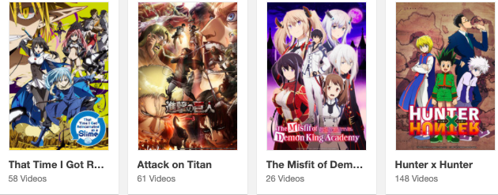
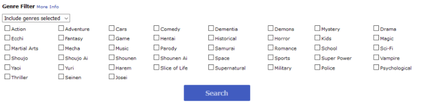
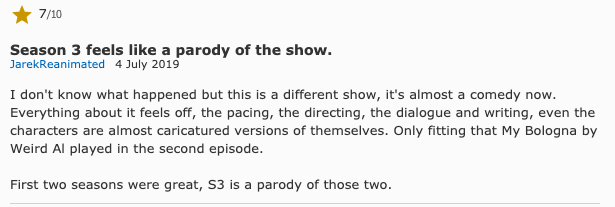

# MitteAnime

## Description

This is a website for anime lovers and people who want to get into anime. This website will utilize the Jikan API `https://jikan.docs.apiary.io/#reference/0/anime` to make 4 calls. Below is an indepth look of the four API calls that we will use.

1. Top - This will show the top, most popular animes at the moment. You can also optionally filter through the type of top shows, e.g. currently airing, upcoming, movies, and specials.
   
2. Genre - You can filter through different animes by genres.
   

3. Reviews - View various reviews written by users themselves.
   

4. News - See the latest anime news, learn about whats upcoming, new releases, series, and titles, etc.
   

## Mandatory Requirements:

---

- Be built with HTML, CSS , and Javascript.
- Use Axios to retrieve data from an external source, and render such data into the DOM.
- Use flexbox, a plus would be to use Bootstrap, or Ant Design, or Material UI, or Tailwind CSS etc, but not a must.
- Implement responsive design on 3 screen sizes, desktop, tablet and mobile using media queries.
- Host on either Netlify or Surge.
- If your API requires the use of an API Key, an ENV file is required.

 

## Setup

---

#### Run Commands:

1. **`npm install -g yarn`**
2. **`yarn init`**
3. **`yarn add parcel-bundler --dev`**
4. **`yarn add axios`**

---

## WireFrames

Desktop - News page

---

Desktop - Top page

---

Desktop - Genre page

---

         Tablet - Top page

---

         Smartphone - Genre page

---

         Smartphone - Genre page

