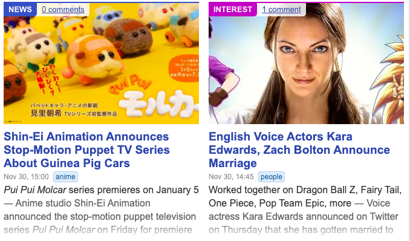

# MitteAnime

## Description

### This is a website for anime lovers and people who want to get into anime. This website will utilize the Jikan API to make 4 calls. The first API call will be used to allow users to see new and most watched series. The next API call is Genres this will allow users to filter content based on the genre that the user is looking for. The third API call is reviews. Review will allow users to read what other have thought about the show. The fourth API call is News. This API call will provide users with updated and current information, like new title release dates, upcoming seasons to name a few. Below are the four calls broken down with images showing how each one will work.

1. Top - This will show the top, most popular animes at the moment. You can also optionally filter through the type of top shows, e.g. currently airing, upcoming, movies, and specials.
   
2. Genre - You can filter through different animes by genres.
   

3. Reviews - View various reviews written by users themselves.
   

4. News - See the latest anime news, learn about whats upcoming, new releases, series, and titles, etc.
   
   

## Mandatory Requirements:

---

- Be built with HTML, CSS , and Javascript.
- Use Axios to retrieve data from an external source, and render such data into the DOM.
- Use flexbox, a plus would be to use Bootstrap, or Ant Design, or Material UI, or Tailwind CSS etc, but not a must.
- Implement responsive design on 3 screen sizes, desktop, tablet and mobile using media queries.
- Host on either Netlify or Surge.
- If your API requires the use of an API Key, an ENV file is required.

 

## Setup

---

#### Run Commands:

1. **`npm install -g yarn`**
2. **`yarn init`**
3. **`yarn add parcel-bundler --dev`**
4. **`yarn add axios`**

---

## WireFrames

